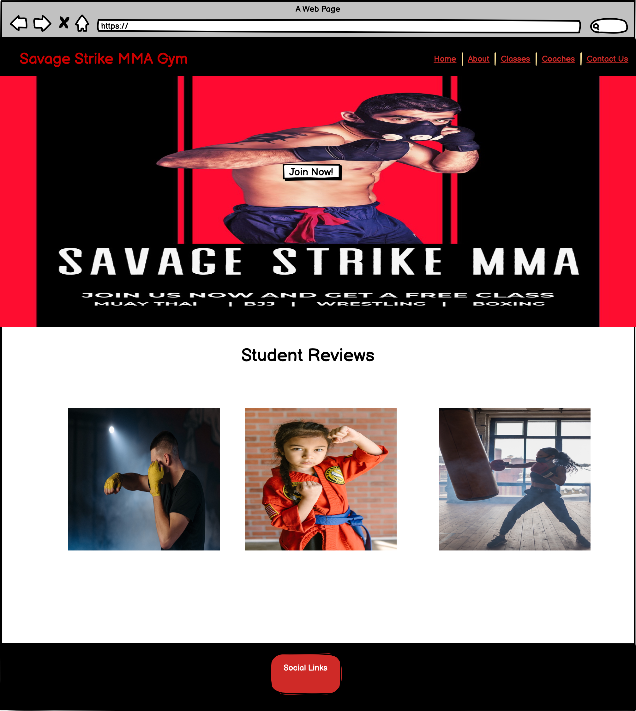
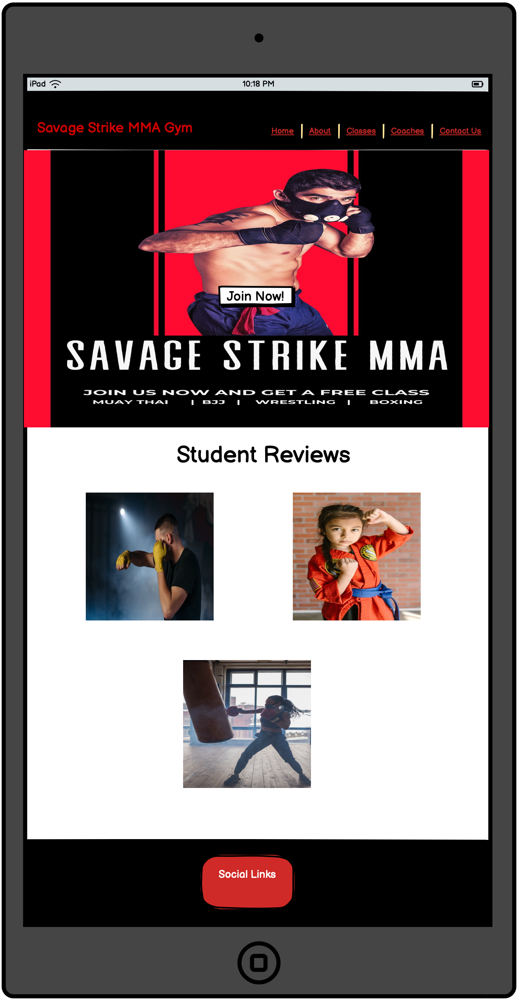
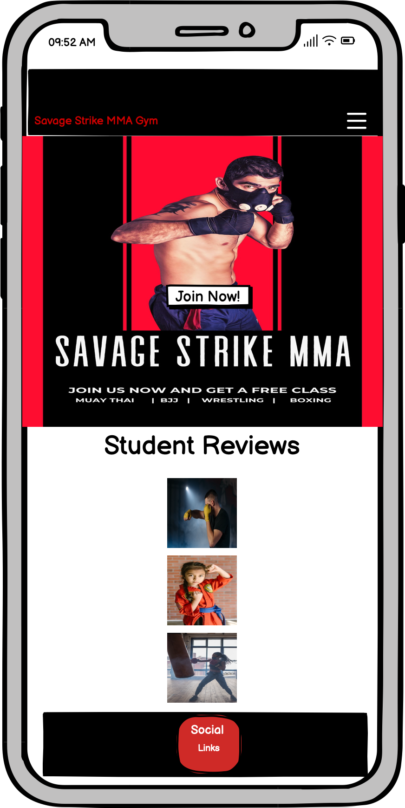

# SAVAGE STRIKE MMA FIGHTING GYM 

# A responsive website of a Savage Strike MMA to show what they offer to the students, share their approach and increase the number of students subcriptions, and visitors 

## Code Institute - Milestone Project 1 

### HTML/CSS Essentials - Users Sentric, Static Front-End Website

### By Davinder Torna

[View Repository in GitHub Pages] (https://github.com/Deesingh92/Savage-MMA-Gym)

[view Website Link ] (https://github.com/Deesingh92/Savage-MMA-Gym)
## Purpose Of the Website

Made the gym more accessible to students giving them the possibility to see the live classes timetable, and get to know what the gym offers.

Share the approach of the fighting gym, and information about coaches, workshops and MMA related articles.
 
## The Business Goal

+ Increase the number of new students 
+ Increase sales on Introductory offers

## (UX) User Experience: 

Users will be able to find relevant information in the website to email the studio, to book classes online, see any changes in the timetable, get to know the approach of the teachers and read descriptions of the differents classes taught in the gym and be able to decide wich class is best for them.

User will access to contact information and they will be able to see the location of the gym.

- ### User Stories

  - #### First time Users Goals:
     - To be captivated by the content.
     - To get to know about Introductory offer.
     - To Understand the approach and the different MMA  classes in the gym.
     - To know the location of the studio.
  - #### Returning Users Goals:
     - To remember how to find relevant information 
     (Remember how to navigate).
     - Find the best and easy way to contact the studio.
     - Find relevant links.
  - #### Frequent Users Goals:
     - To see if there is any new offer.
     - Find updates in the timetable.
     - Find new workshops.
     - Find when there is a cover teacher running a class.

## Design:

The design of the website is made to invite visitors to come, to get to know the gym, the fighting approach and MMA styles, and to book classes and offers.
So I tried to do a simple web with red and black pallete, which is easy to navigate through and pleasant at the same time, also Include some "motivational" pictures of students doing some sparring to show what they will be capable to learn if they decided to join and practice MMA in the gym.

### Design Brief:

+ Colour:

The main colours used in the web are: 

- Dark Red: Symbolism: Red is often associated with passion, strength, and power, which aligns well with the intense nature of MMA. It represents the energy and determination exhibited by fighters in the ring.

Visual Impact: Dark red is a bold and attention-grabbing color. It can help create a strong visual impact and draw visitors' attention to key elements on the website, such as headlines, buttons, or important information.

Contrast and Legibility: Dark red can provide a striking contrast against lighter colors, making it easier to read text and navigate the website. It can enhance legibility and ensure that important information stands out

- Black:  Black can be an effective choice, it's essential to consider the overall design, usability, and accessibility of the website. Proper use of white space, typography, and other design elements will ensure that the website remains visually engaging and user-friendly.

Elegance and Sophistication: Black is often associated with elegance, sophistication, and power. Using black as a dominant color can give the website a sleek and stylish look, creating a sense of professionalism that aligns with the high-level athletic competition in MMA.

- Off-White: Clean and Modern Aesthetic: Off-white is a neutral color that creates a clean and modern look. It provides a sense of simplicity and minimalism, which can be visually appealing and make the website feel more contemporary.

Focus on Content: Off-white backgrounds can help draw attention to the content on the website, such as images, videos, and written information. The neutral color allows the content to take center stage without distractions, ensuring that visitors can easily engage with the MMA-related information.

Contrast and Readability: Off-white provides a good contrast against darker text, making it easier to read. This is particularly important for websites that contain a lot of textual information or articles related to MMA events, techniques, or fighter profiles.

- Links : The colour of the Links to navigate in the index.html are off-white with the purpose to made easy to users to identify that they are external links.

+ Typography:

- Rubik Wet Paint = Logo

- Roboto Slab = Section Headings

- PT Sans = Paragraphs

+ Images:

- Background Image/ Hero Image/ home page: I used a image of a man posing in a MMA stance using the the same color pallete to match the rest of the website, to provide light and flowing website.

- Sections images: In the other sections I used images of MMA coaches doing some fancy poses to try to create some motivation in  users, to invited them to start or keep practicing MMA.

- Classes image: I choose a picture where coaches are sparring, to show the hardwork involved in classes at Savage Strike MMA
## Wireframes:

The Basic structure of Savage Strike MMA was skectched using [balsamiq](https://balsamiq.com/).

Here some images of the proccess( to see full wireframe click PDF) : 

-  PC Mac screen: 

- Tablet screen: 

- Mobile screen: 

- PDF:  
  [Wireframe PDF](https://drive.google.com/file/d/1Ma2lZGsFX_GElv23_iktQVi_kj2reLCx/view?usp=sharing)

## Features

 - #### Existing Features:
     
   + Navigation bar there are links to the “Home”, “classes” "about" and  “contact” page.

   + Buttons to redirect to a future app to be able to book and made online payments.

   + iframe to show the location in google maps

   + Form : Icluded in the footer section, the users can always see the oppornutity to register.

   #### (future features)

    "buttons to link with and app to do online payments and online booking" (mindbody app)

## Technologies: 

### Languages used: 

- [HTML](https://en.wikipedia.org/wiki/HTML5)

- [CSS](https://en.wikipedia.org/wiki/CSS)

### Also I used: 

- [Bootstrap](https://en.wikipedia.org/wiki/Bootstrap_(front-end_framework)

  From Bootrap I used: grid system, the nav, the buttoms, modals and part of the forms layout. 
  Everything has been modify to the project requirements and styled with CSS.
  

- [Google Fonts](https://en.wikipedia.org/wiki/Google_Fonts)

- [Font awesome](https://fontawesome.com/v4.7/icons/)

- [Balsamiq](https://balsamiq.com/)

- [Pexels](https://www.pexels.com/)

## Testing: 

### Testing results:

- [W3C Markup Validation Service](https://validator.w3.org/)

 + To validate HTML and CSS code.

 
 Index.html :

-  Errors: 

 Ahimsa.html :

-  Errors: 

Validators Results :

Index.html 

classes.html 

about.html 

team.html 

contact.html 

style.css 

### Lighthouse results:

Index.html : 

Classes.html : 

About.html : 

Contact.html : 

### Testing User Stories from User Experience (UX) Section

 #### First Time Visitor Goals: 

  ######  As a First Time Visitor, I want to easily see the studio offers, find when the classes take place (timetable) also the prices and offers:
     
     - Upon entering the site, users will see the first a hero image
     so the users can get an idea of what they are potentially signing up for.

     - Within the hero image there is a botton called "Join Now!" a call to action offer showing the new members offer. 
     and a button which open a modal to Sign Up, 
     so users can easyly click and sign to the offer.
     (with futures features they will be able to made payments)

     - After this the Users can find 3 images which give 3 different students of different ages and walks of life reviews of the studio, which show that the gym is univesal and open to anyone.

     - Following the links there is an introduction of the teachers that works in the studio, 
     so users know what to expect in the classes before they proceed with the booking.

  #####  As a First Time Visitor, I want to be able to easily be able to navigate throughout the site to find content and find where the studio is located:

    - At the top of each page the is a header with the logo and the navigation menu, 
    which makes it easy to navigates through the four pages of the site. 

    - At the botton of the header in the Index page, there are reviews from students.

    - At the bottom of the footer there are links to the social pages of Savage Strike MMA.

    -In the Contact page the users can fin a call of action link wich get to the iframe map location
     at the botton of the page and also to the contact us information.

  ##### As a first time visitor I want to see some stories and reviews from other ussers to get to know the studio. I also Want to find the links to the social media to find more information about the studio and ussers thoughts and reviews and be able to determine how trasted and known the studio is:

    - After the teaching section the users can read some reviews from others visitors.

    - at the botton of the Visit us here the user can find links to social media, 
    link to the gym e-mail and the iframe google map location in the center of page, big and clear.
 #### Returning Visitor Goals: 

  ##### As a returning Visitor, I want to book easyly classes and workshops:
   
    - The links for classes/ Prices and workshops are right on the middle in the home page.  
      This pages two will be the most visited pages for a returning visitor

    - In the classes and workshops pages are buttons with open a modal to be able to register to a future app 
    (mindbody-online-app), in wich the users will be able to made online bookings and payments.

  ##### As a returning Visitor, I want to fin any new updates in the timetable and workshops section:

    - When signing the users recieve a monthly e-mail with every update.

    - Also Updates in the timetable will be highlighted in the timetable.

  ##### As a Returning Visitor, I want to find the best way to get in contact with the organisation with any questions I may have:

    - In the same section users can find social media links.

 #### Frequent Users Goals:

##### As a Frequent User, I want to be able to book a class easily:

    - The user would already be comfortable with the website layout and can easily click 
    the classes link to book in the timetable with a few clicks.

##### As a Frequent User, I want to check to see if there are any new workshops.

    - The user would already be comfortable with the website layout and can easily click the classes page.

#####  As a Frequent User, I want to sign up to the Newsletter so that I am emailed any major updates and/or changes to the class timetable, website workshops or events.

    
    -  There is a "Join " button just underneath of the input field which is located close to the field 
      and can easily be distinguished.

## Deployment:

### Inception:

 + This project was created using Code Institute template from GitHub:

 + After the creation of the project, I rename it as : Savage-MMA-Gym.

 + In order to push this project from GitPod to Github I used a set of git commands on the terminal: 
  
 - git status  - Check the status of the repository and see if there were any changes in files 

- git add .  - Add the files that were modified/created, so we can commit it 

- git commit -m "message for commit"  - Commits all the changes

- git push  - Pushes all committed versions to GitHub.

#### Deployment to GitHub Pages:

+ The project was deployed to GitHub Pages using the following steps:

- Log in to GitHub and locate GitHub Repository

- At the top of repository click on "Settings"

- Once you are in settings scroll down to "GitHub Pages"

- Under "Source", click the dropdown called "None" and select "main Branch".

- After the page automatically refresh scroll down again on "GitHub Pages" and I will  see live link to the published site.

### Cloning repository:

+ Local Clone

- Log in to GitHub and locate GitHub Repository

- At the top of repository click on Code

- From the dropdown menu under HTTPS copy the link

- Now on the IDE create a directory where you want to make the clone

- Type git clone and paste the link that you copy from step 3.

### Forking repository:

By forking the GitHub Repository we make a copy of the original repository on our GitHub account to view and/or make changes without affecting the original repository by using the following steps:

- Log in to GitHub and locate the GitHub Repository
- At the top of the Repository (not top of page) just above the "Settings" Button on - - the menu, locate the "Fork" Button.
- You should now have a copy of the original repository in your GitHub account.

## Credits:

## Aknowledgements:

A huge thank you to my mentor who has been incredibly helpful and approchable throughout this project.

Likewise, to the tutors for helping through to completion on this.

And to the main teacher at the City of Bristol College.

Big Thanks.

### Read me based on the Code Institute README sample:

[Readme Sample](https://www.pexels.com/)
